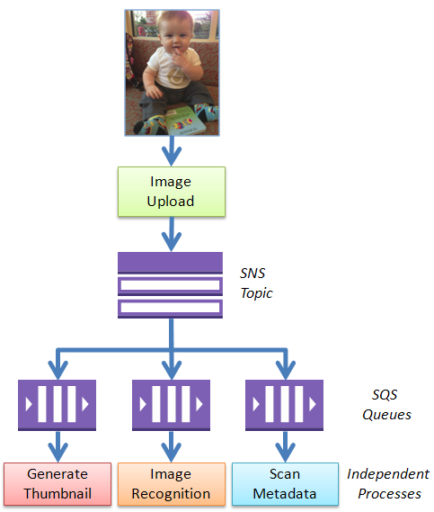

# AWS Events

There are some primary differences between SQS and SNS, owing to the way they are designed and the purpose they serve. 

* SQS does not push messages to the consumers, instead, consumers have to poll the queue, 
   and as soon as one of  them receives a message, the message is out of the queue and no other consumer can access it. This polling inevitably introduces a certain latent delay in message delivery. 

* SNS pushes the messages to all its subscribers as soon as it receives it,
   hence there is no latency and you can easily add subscribers down the line. 

* SQS is mainly used to decouple applications or integrate applications.

* SNS is used to broadcast messages and it’s up to the receivers how they interpret and process those messages

## SNS vs SQS: Use Cases

Lets now have a look at some sample application scenarios:

1. SQS can be used in scenarios where the order of events ( and the order of processing them) are important. Also, in cases where multiple similar processors (actors) are present to get hold of a message and process it, at a given point in time any one of these processors gets to receive and process the message.

E.g. Processing multiple commands in the right order. 

A user can fire successive commands on a system and there are many threads that can process them. An SQS can ensure that user-entered commands are executed in the right order. Moreover, it can ensure that the output of the previous command can be used as input for the next. 

2. SNS can be used in scenarios where multiple subscribers receive the same message and process it according to their responsibilities/capabilities simultaneously. 

E.g. A food ordering App can generate order confirmations message(s) which can then be distributed via SNS to the pickup and delivery boy (on his mobile), the Kitchen manager (on his Tab), to the Bookkeeper(on his Desktop) and to the BI and Analytics tool (via API or database call). These subscribers can then move ahead and fulfil their duties to achieve the final goal. 

SNS vs SQS: Sample Cooperative Scenarios 

## Describe how to use SQS and SNS in a “fanout” pattern.

